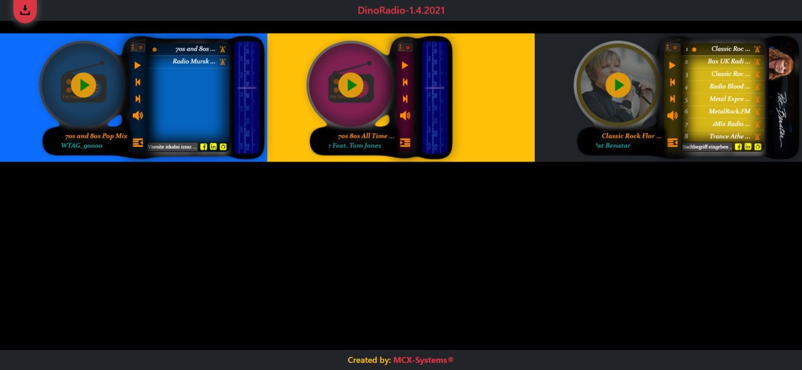

# DinoRadio
Jquery plugin for listening to web radio with playlist support.

[](https://github.com/MCX-Systems/DinoRadio/graphs/commit-activity)


## Example Page
Live example page: [http://mcx-systems.net/DinoRadio](http://mcx-systems.net/DinoRadio/)

## Preview Page Screenshot


## Supported Browser
 |  |  |  | 
--- | --- | --- | --- | --- |
Latest ✔ | Latest ✔ | 9+ ✔ | Latest ✔ | 8.0+ ✔ |

Tested in latest Edge, Chrome, Firefox, Opera, Safari and Mobile Safari \

## Install
You can install through [npm](https://npmjs.com) and use [browserify](https://browserify.org) to make it run on the browser.
```bash
npm install --save dinoradio

or

$ yarn add dinoradio
```

Or just download the minified version
[here](https://raw.githubusercontent.com/MCX-Systems/DinoRadio/master/dist/dinoRadio.min.js).

## Functions

- Poster style can be square or circle
- If playlist is empty, default playlist is loaded from API
- RDS Radio for getting current playing song and artist
- Latest Artist images Thumbnail and Banner
- Current playing song lyrics lookup, if found \
  icon feather shows up and starts to blink.
  Click on it to open Lyrics Overlay.
- If you click on right side banner, if found Artist biography is shown \
  in biography overlay
  
Example for dinoRadio player
------------------------

```js
$(document).ready(function()
{
	$('#RadioExample1').dinoRadio({
		autoPlay: false,
		showEqOnPlay: true,
		showPlaylistNumber: false,
		posterStyle: 'circle',
		stationPlaylist: [{
			url: '',
			station: 'Station Name'
		    },
			{
				url: '',
				station: 'Station Name'
			},
			{
				url: '',
				station: 'Station Name'
			},
			{
				url: '',
				station: 'Station Name'
			},
			{
				url: '',
				station: 'Station Name'
			},
			{
				url: '',
				station: 'Station Name'
			},
			{
				url: '',
				station: 'Station Name'
			}],
		// Enable plugin debug
		debug: true
	});
});
```